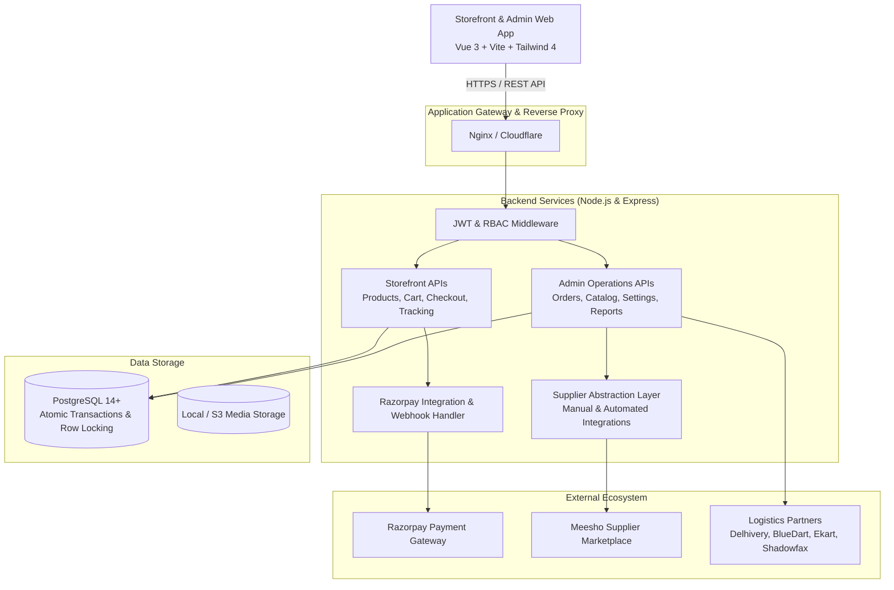
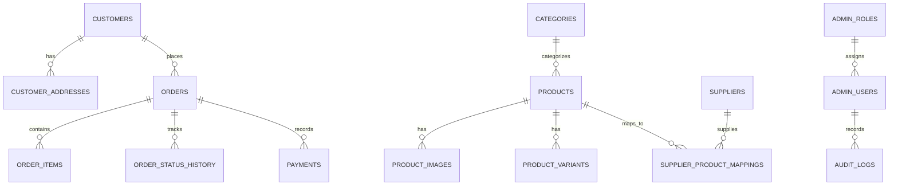

# System Architecture Documentation

This document describes the architectural principles, data flows, database design, and security architecture of the India-First Dropshipping E-Commerce Platform.

---

## 1. High-Level System Architecture

---

## 2. Core Architectural Principles

1. **India-First Localization**:
   - Monetary values are stored as integers in **paisa** (`selling_price_paisa`, `cost_price_paisa`, `total_amount_paisa`) to prevent floating-point rounding errors.
   - Built-in validation for 10-digit Indian mobile numbers (`^[6-9]\d{9}$`) and 6-digit Indian PIN codes (`^[1-9][0-9]{5}$`).
   - Native support for COD (Cash on Delivery) with optional surcharge and risk mitigation rules.
2. **Zero-Hardcoded Branding**:
   - The application does not hardcode any brand names, phone numbers, email addresses, or theme colors.
   - Store settings are persisted in `store_settings` and exposed via `/api/settings/public`.
   - Frontend dynamically updates CSS root variables (`--store-primary`, `--store-accent`, `--store-background`, etc.) and document title on startup.
3. **Low-Click Dropshipping Fulfillment Station**:
   - The platform decouples order placement from fulfillment.
   - For marketplace dropshipping (Meesho, IndiaMART), the admin portal provides a 1-click clipboard formatter that formats customer addresses into the exact format expected by supplier checkout interfaces.
   - Stores supplier URLs, supplier SKUs, and purchase costs for automatic profit margin calculations.
4. **Supplier Abstraction Layer**:
   - `supplierService.js` defines a standard interface (`placeOrder`, `fetchTracking`, `verifyStock`).
   - Today's manual marketplace workflow is handled via `manualMarketplaceProvider.js`.
   - Tomorrow's direct supplier APIs can be plugged in by adding a provider to `src/integrations/suppliers/` without altering storefront or database schema.

---

## 3. Database Schema & Relational Model

### Key Tables & Entities

- **`store_settings`**: Key-value settings partitioned by category (`general`, `branding`, `checkout`, `storefront`, `seo`).
- **`customers`**: Registered shoppers and guest checkout records with password hashes and refresh token tracking.
- **`customer_addresses`**: Standardized Indian delivery addresses with landmark and default address flags.
- **`products`**: Catalog items with price paisa, compare-at MRP, supplier cost price, and stock levels.
- **`supplier_product_mappings`**: Connects internal products to external supplier links (e.g. Meesho URLs, supplier SKUs, and wholesale prices).
- **`orders`**: Full lifecycle orders with statuses (`pending`, `confirmed`, `processing`, `shipped`, `delivered`, `cancelled`), payment breakdown, and logistics metadata.
- **`order_items`**: Snapshots of purchased items with unit price, product title, image, and supplier URL.
- **`order_status_history`**: Audit trail of every status transition with user attribution and operational notes.
- **`coupons` & `coupon_redemptions`**: Percentage and flat discount codes with usage limits and order minimums.
- **`reviews`**: Customer ratings and comments with moderation queue (`pending`, `approved`, `rejected`).
- **`audit_logs`**: Immutable security log of administrative changes (IP address, old values, new values).

---

## 4. Security Architecture

1. **Authentication & Token Lifecycle**:
   - Dual authentication pipelines: customer sessions and admin sessions.
   - Short-lived JWT access tokens (15-minute expiry).
   - Long-lived rotation refresh tokens (7-day expiry) stored in HTTP-only, SameSite cookies.
   - Refresh tokens are hashed with SHA-256 before storage in PostgreSQL; tokens are revoked upon logout.
2. **Password Security**:
   - Passwords hashed using `bcrypt` with cost factor 12.
3. **Webhook Security**:
   - Razorpay payment webhooks are verified using cryptographic timing-safe HMAC SHA-256 comparisons (`crypto.timingSafeEqual`) to prevent timing attack vulnerabilities.
4. **Network & Header Security**:
   - `helmet` security headers configured for clickjacking and MIME-type sniffing defense.
   - Granular CORS rules restricting cross-origin requests to configured client domains.
   - Express rate limiters applied to authentication endpoints (max 20 requests per 15-minute window) and general endpoints.
